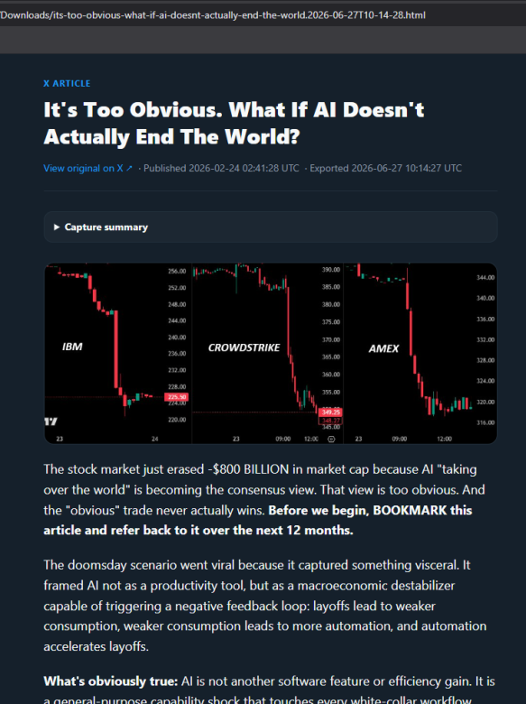
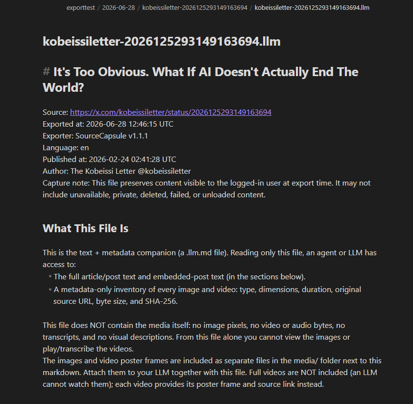
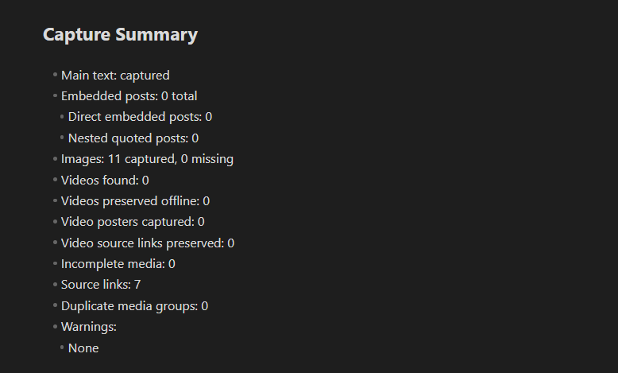
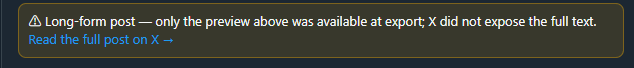
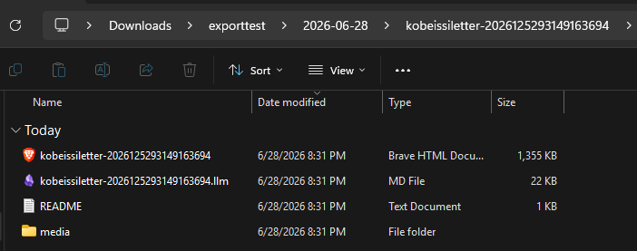
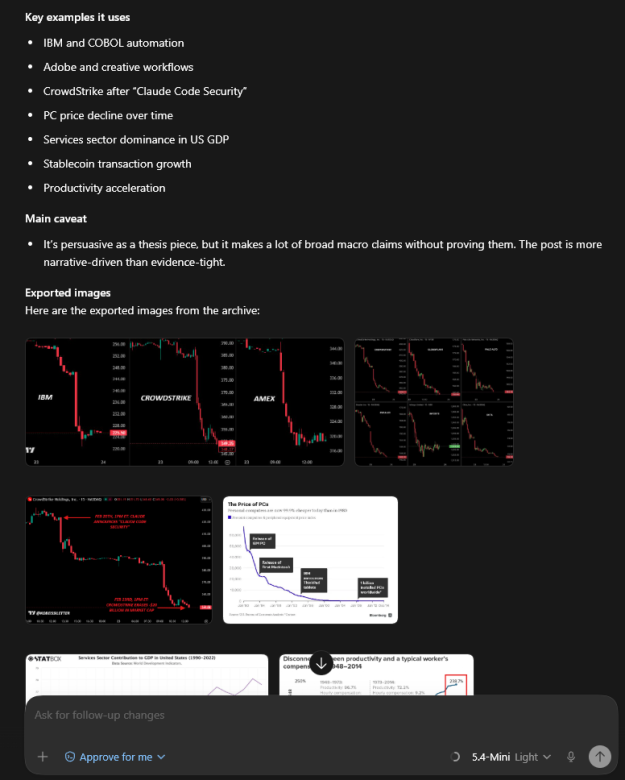
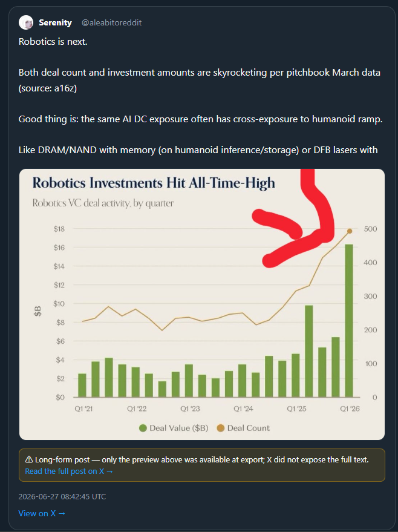

# SourceCapsule

> Save an X (Twitter) **Article** or **post** as a self-contained `.html` archive plus
> a clean `.llm.md` companion file for model ingestion.

SourceCapsule creates an offline reader archive with **successfully preserved media embedded
directly into the HTML**. When something cannot be preserved, it is shown as **incomplete
media** with its source link kept for provenance — never silently dropped or mislabelled as
captured. The Markdown companion is a compact context file for LLMs: clean text, quote
boundaries, media references, warnings, and source links, without base64, CSS, or JavaScript.

- 🗂️ **Offline archive, zero dependencies** — successfully captured media is inlined into the HTML.
- 🧠 **LLM Markdown companion** — clean context without base64, CSS, JavaScript, or media bytes.
- 📁 **Save to library** — drop each export into its own dated, per-post folder (Markdown + the
  actual image/poster files alongside) so you can point an agent at a folder and say _"summarize
  today's exports."_ See [Save to library](#save-to-library-agent-ready-folders).
- 💬 **Quoted posts are rebuilt as real, selectable HTML** — not screenshots.
- 🎞️ **Honest media accounting** — offline videos, poster-only videos, failed downloads, and missing media are reported separately.
- 🎯 **Per-post Export buttons** — export exactly the post you mean, not the wrong one.
- 🎛️ **Choose your output** — Save to library, HTML + Markdown, HTML only, or Markdown only.
- 🌗 **Clean reader layout** with automatic light/dark mode.
- 🔒 **Runs locally in your browser** on content _you_ can already see while logged in. See [Security & privacy](#security--privacy).

> Status: **v1.0.0 — first public release.** The media-honesty rules are implemented and
> verified by local export audits on real articles, posts, and videos. The export engine is
> solid; the fragile part is reading X's ever-changing page — see [Limitations](#limitations).

### Honesty first

SourceCapsule's guiding rule: **an archive must never claim more than it preserved.**

A video is only reported as **preserved offline** when the archive actually contains a
playable offline video file, with byte size and SHA-256 metadata when available. When the
full video cannot be captured, SourceCapsule says so plainly: poster/source-link fallback is
labelled **incomplete media**, never "captured." The same accounting is mirrored in the HTML
capture summary, the `.llm.md` companion, and the embedded debug manifest.

---

## Screenshots


_One click on any X post or article — Save to library, HTML, Markdown, or both._



_The archive opens straight from a `file://` path — fully offline, nothing left to load or rot._



_The clean `.llm.md` companion — source, version, author, and an honest "What This File Is" header._



_Every image and video is accounted for — and anything incomplete is flagged (here: none)._



_When X only exposes a preview, the archive says so plainly instead of pretending it's complete._



_Save to library drops each post into a dated, per-post folder — text plus the real image files._



_Point an AI at the folder and it reads the text **and** sees the real exported images._



_Quoted tweets are rebuilt as real, selectable HTML cards with their own media — not screenshots._

Ready-made examples of the output are in [`examples/sample-export.html`](examples/sample-export.html)
and [`examples/sample-export.llm.md`](examples/sample-export.llm.md).

---

## Install (for everyone — no coding needed)

This is a **userscript**. You need a free browser add-on that runs userscripts, then you
add this one script to it.

### 1. Install a userscript manager

Pick one and install it from your browser's add-on store:

- **Tampermonkey** — Chrome, Edge, Firefox, Safari, Opera _(recommended, most common)_
- **Violentmonkey** — Chrome, Edge, Firefox

After installing, you'll see its icon near your browser's address bar.

### 2. Add SourceCapsule

1. Click this link to the raw script:
   **[`sourcecapsule.user.js`](https://raw.githubusercontent.com/wolfgang-aura/SourceCapsule/main/sourcecapsule.user.js)**
2. Tampermonkey/Violentmonkey will open an install page showing the script details.
3. Click **Install**.

That's it. The script updates itself when new versions are published.

> Prefer to install by hand? Open the userscript manager → **Create a new script**, delete
> the template, paste the contents of [`sourcecapsule.user.js`](sourcecapsule.user.js),
> and save (Ctrl/Cmd+S).

---

## Usage

1. Log in to **x.com** and open an **Article** (`x.com/i/article/…`) or a **single post**
   (`…/status/…`).
2. Pick what to export, using the inline **Export** button in the post/article header:
   - **A specific post** — each post carries its own **Export** button in its header, so you
     export exactly that post and never grab the wrong tweet.
   - **The whole article** — an **Export article** button sits in the article header.
   - _Optional:_ a draggable page-level Export button (bottom-right) is available too, but it's
     **off by default** — turn it on in the userscript-manager menu (see [Settings](#settings-in-the-userscript-manager-menu)).
3. A menu opens with four choices: **Save to library**, **HTML + Markdown**, **HTML only**, or
   **Markdown only**. Click one.
4. A small status message shows progress while it embeds the media, then your browser
   downloads the file(s), named after the article/post. (For **Save to library**, see the
   [next section](#save-to-library-agent-ready-folders).)
5. Open the `.html` any time — even with the internet off.

To confirm a media-complete export is truly self-contained: open the file, press
<kbd>F12</kbd> → **Network** tab → set throttling to **Offline**, then reload. Everything
that was preserved should still display. (Items shown as _incomplete media_ keep only a
source link, which needs the internet — that's by design.)

---

## Save to library (agent-ready folders)

**Save to library** is the option to use when you want exports an LLM or agent can actually read.
Instead of dumping a 200 MB self-contained `.html` on a model, it writes a small, organized,
per-post folder:

```
<your export folder>/            ← you pick this once; it's remembered
  2026-06-28/                    ← grouped by export date
    dingyi-2070029723673981185/  ← one folder per post (stable name; re-exporting overwrites)
      post.html                  ← full offline archive (only in "full" mode)
      post.llm.md                ← clean Markdown that references the media/ files
      media/                     ← the actual images + video poster stills
      README.txt                 ← how to hand the folder to an LLM
```

Then you can point an agent at, say, `…/2026-06-28/` and ask it to *"go through today's exports and
summarize them"* — it reads each `post.llm.md` and sees the real images next to it.

**Why it stays small:** the `media/` folder holds images and a **poster still** for each video —
never the raw video bytes. An LLM can't watch a video anyway, so the one thing that makes archives
huge is left out. (The full playable video still lives in `post.html` when you keep "full" mode.)

### Folder vs. zip — browser support

Writing directly into a folder uses the browser's **File System Access API**, which is **desktop
Chromium only**. On everything else, Save to library produces one tidy **`.zip`** with the same
per-post layout instead (extract it once and you have the same folder).

| ✅ Writes a folder directly | ❌ Saves a `.zip` instead |
| --- | --- |
| **Chrome** 86+ | **Brave** (removed the API for privacy) |
| **Edge** 86+ | **Firefox** (not implemented) |
| **Opera** 72+ | **Safari** (no directory picker) |
| **Vivaldi**, **Arc** | **All mobile browsers** |

The first time you Save to library on a supported browser, it asks you to pick the export folder
and grant write access (the browser may re-confirm that access about once per session — a security
rule we can't bypass). After that, exports drop in automatically.

### Settings (in the userscript-manager menu)

There is no in-app settings panel. Two preferences live in your userscript manager's menu (click
the **Tampermonkey/Violentmonkey icon** while on x.com):

- **Layout** — `by date` (default, grouped into date folders) or `flat` (all post folders at the
  top level, named `2026-06-28_<handle>-<id>`).
- **Contents** — `full` (default, includes the heavy `post.html`) or `lean` (Markdown + media only,
  for a small, fast, agent-friendly library).
- **Change export folder…** — pick a different root folder.
- **Floating button** — `off` by default; turn `on` to show the draggable page-level Export
  button in addition to the inline header buttons.

---

## What gets captured

| Content | Behaviour |
| --- | --- |
| Title, author, body text | ✅ Captured in reading order with headings, emphasis, lists, and links |
| Images | ✅ Inlined at full resolution when accessible; unavailable images are marked as missing/incomplete media |
| Quoted / embedded posts | ✅ Rebuilt as styled, selectable cards with their own text, links, timestamps, and media |
| LLM Markdown | ✅ Clean `.llm.md` with metadata, quote boundaries, media references, warnings, and source links |
| MP4 video successfully downloaded | ✅ Inlined as a playable offline `<video>` with MIME, byte size, SHA-256, and duration when available |
| Video detected but MP4 unavailable/blocked | ⚠️ Marked as **incomplete media**; poster and source link preserved when available |
| HLS-only video | ⚠️ Not reassembled in v1; marked as **incomplete media** |
| Source URL, author, export time | ✅ Shown in the header/footer and Markdown metadata |

> **About file size:** because videos are inlined as real bytes (no size cap), an archive
> with video can be **large** — tens of megabytes, occasionally 100 MB+ for a long video.
> That's the cost of a genuinely self-contained, offline-playable file. Image-only and
> Markdown exports stay small. Use **Markdown only** when you just need the text for an LLM.

### Video preservation states

SourceCapsule distinguishes video states carefully, and **only `offline-video` counts as
captured** — every other state is incomplete media:

- **`offline-video`** — the actual video file is embedded and playable without internet.
- **`poster-only`** — the video was detected, but only the poster image and source link were preserved.
- **`download-failed`** — a video URL was found, but the file could not be downloaded or validated.
- **`discovery-failed`** — a video was visible, but no downloadable MP4 URL could be found.
- **`unsupported`** — the format isn't supported by the current exporter (e.g. HLS-only).

These states appear in the HTML capture summary, the `.llm.md`, and the embedded debug
manifest, so an archive can be audited offline without trusting any single label.

---

## The LLM Markdown companion

The `.llm.md` file is built from the same model as the HTML, but **never embeds media
bytes**. It opens with a `## What This File Is` header so any agent immediately knows what it
does and does not contain, and it never names a file that isn't actually on disk. It references
each media item and reports honestly where the bytes live — which is why the file stays small and
why it doesn't claim to "understand" video. The exact wording adapts to how you exported:

```text
# Save to library (bundle): media are real files next to the markdown


[Video: video-002 - 0:32, 3404x2130, full video not included in this bundle, poster frame media/video-002.poster.jpg, source link preserved]

# HTML + Markdown: media live in the companion .html that downloaded alongside
- Bytes location: embedded in companion file dingyi-….html (not in this markdown)

# Markdown only: nothing was saved, only metadata + the original source URL
- Bytes location: captured but not saved (Markdown-only export); metadata only
```

When author metadata can't be read from the page, the Markdown falls back to the `@handle` in the
source URL (flagged as derived) so the reader still knows who posted it. It contains **no** base64,
data URLs, CSS, or scripts by design.

---

## Limitations

Read these before relying on it — they're inherent to the approach, not bugs:

- **Video preservation is best-effort, not guaranteed.** The exporter tries X GraphQL/API
  variant lists, DOM player URLs, performance entries, page JSON/script payloads, and
  syndication MP4 variants before fallback. If X only exposes HLS, hides the full MP4
  variants, blocks the fetch, or every MP4 request fails validation, the archive records a
  poster/source-link fallback as **incomplete media** instead of counting it as captured.
- **No video understanding yet.** Videos may be preserved as playable MP4 bytes, but the LLM
  Markdown does not include transcripts, OCR, keyframes, or visual descriptions yet.
- **Long-form embedded posts are preview-only.** X's public API only exposes a preview for
  long-form ("note") posts shown inside an article, not the full text. The export captures the
  preview and clearly **marks it as truncated** (a visible notice in the HTML and a
  `Text status: truncated` line in the Markdown) with a link to the full post — it does not
  silently present the preview as complete.
- **Reader layout is not pixel-perfect X.** The exported HTML is a clean offline reader view.
  It preserves order, links, media, headings, and provenance, but fonts, wrapping, spacing,
  and some heading emphasis can differ from X's live UI.
- **X changes its page structure often.** When it does, parts of an export may go missing
  until a selector is updated. The script logs clear `[SourceCapsule]` warnings in the console
  instead of crashing, and **all** the brittle selectors live in one clearly-marked `CONFIG`
  block so they're quick to fix. Please [file a bug](../../issues/new/choose) with the
  console output if this happens.
- **Threads and batch export are not in v1.** See [Out of scope](#out-of-scope-for-v1).
- **You must be logged in**; the tool only ever captures what's already visible to you.

---

## Out of scope for v1

Deliberately not built yet:

- multi-tweet **thread** export
- **batch export** from a list of URLs
- AI summaries
- OCR
- video transcripts
- video keyframes / visual descriptions
- **HLS video** download/reassembly
- full **long-form (note) post** text retrieval (needs X's authenticated API; previews are flagged as truncated instead)
- a packaged browser **extension**
- an in-app **settings panel** (preferences live in the userscript-manager menu instead)
- a top-level library **catalog/index** file (agents can walk the date folder directly)

In short: videos may be saved as playable files, but the LLM still does not understand their
contents.

---

## Public release gate

Before the first public release (v1.0.0), representative exports must pass the local audit
(`node scripts/audit-release.mjs <folder>`):

- HTML opens offline; all successfully captured images and videos are embedded.
- Poster-only / failed videos are counted as **incomplete media**, not captured.
- `.llm.md` contains no base64, CSS, JavaScript, or data URLs, and uses accurate video wording.
- Missing/incomplete media appears consistently in the HTML summary, Markdown, and debug manifest.
- Source links and timestamps are preserved; embedded posts stay separated from the author's text.
- Obvious truncated quoted posts are marked; timeline/source cross-references point to the right post.

---

## How it works (for the curious)

The code is one file, split into two layers with a clear seam:

1. **Fragile layer** — reads X's DOM and produces a plain-object _model_. All of X's
   selectors live in the `CONFIG` block.
2. **Stable layer** — the durable engine: a privileged fetch (`GM_xmlhttpRequest`, which is
   what lets us read media bytes past the browser's CORS wall) → base64 → assemble a
   self-contained HTML document → download.

To find the full MP4 behind a video, the script also reads X's own network responses in your
browser (the same API data the page already loaded) to extract the highest-quality MP4
variant. This stays entirely on your machine — see [Security & privacy](#security--privacy).

The model is the contract between them, so X's churn rarely touches the engine. More detail
in [`CONTRIBUTING.md`](CONTRIBUTING.md).

---

## Security & privacy

This script asks for powerful userscript permissions, so here is exactly what it does and
does not do. The full review and trust model are in [`SECURITY.md`](SECURITY.md). For the
exact permissions, see the userscript header (`@grant`, `@connect`, `@match`).

**What it can access**

- **Media bytes from `*.twimg.com`** via `GM_xmlhttpRequest`, to inline images/videos past
  the browser's CORS wall. In code, this fetch is restricted to `twimg.com` hosts.
- **X's own API/GraphQL responses in your browser** (`fetch`/XHR), read only to find the full
  MP4 URL behind a video. This is the same data X's page already loaded for you. Those
  responses are inspected in memory only for export; they are not uploaded, stored remotely,
  or sent to any third-party service.
- **The page DOM** of the article/post you're exporting.

**What it never does**

- ❌ **No sending your content anywhere.** SourceCapsule runs locally in your browser. The only
  network requests it makes are fetching media from X's media/syndication hosts to embed
  it — there is no analytics, no server, no telemetry, and your content is never sent to any
  third party. (It does make those media requests _while building the archive_; it does not
  exfiltrate data.)
- ❌ **No posting, liking, following, or any action on your account.**
- ❌ **No reading of DMs, passwords, or anything you can't already see on the page.**

**Safe-by-design output.** The exported HTML is built as escaped strings (no `innerHTML`,
`eval`, or dynamic code from page content). Tweet/article HTML is reduced to a small
allowlist of safe tags, and every link is restricted to `http(s)`/`mailto` so a malicious
link can't execute when you open the archive locally.

**Trust model / auto-update.** The userscript auto-updates from the `main` branch of this
public repo (`@updateURL`). That means you trust this repository's maintainers and GitHub. If
you prefer to pin a reviewed version, install a specific tagged release and disable
auto-update in your userscript manager. Report security concerns via a
[private advisory](../../security/advisories/new) rather than a public issue.

---

## Troubleshooting video capture

If a video appears as **incomplete media**, SourceCapsule detected the video but could not
preserve the actual video file after trying its MP4 discovery paths. Poster-only fallback is
a failure state, not normal successful capture.

Helpful details for a bug report:

- the X URL
- your browser and userscript manager
- the exported `.html` and `.llm.md`, if small enough
- console lines starting with `[SourceCapsule]`
- whether the video played normally on X while you were logged in

---

## Contributing

Issues and PRs welcome — especially selector fixes when X changes. See
[`CONTRIBUTING.md`](CONTRIBUTING.md) for how to test locally and where to look.

## License

[MIT](LICENSE) © `wolfgang-aura`. All code is original; no proprietary userscript or
extension source was copied.

## Disclaimer

This tool only captures content already visible to the logged-in user. You are responsible
for complying with [X's Terms of Service](https://x.com/tos) and applicable law.
